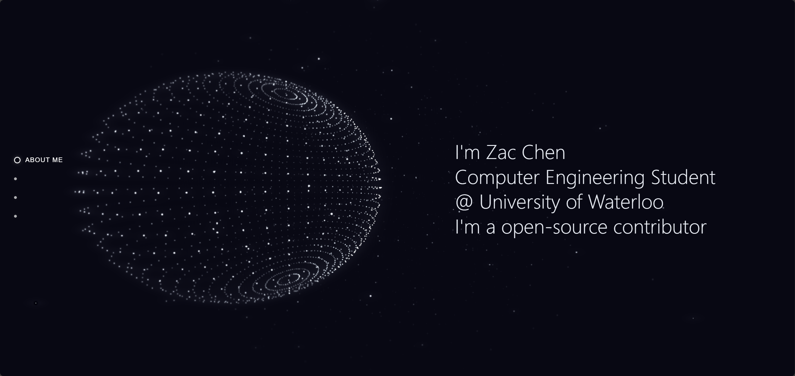

# Portfolio · Particles Effect

This is a personal portfolio website built with **React + Three.js**, featuring **particle effects** to showcase different sections (About, Projects, Experience, Contact).  
When switching between sections, particle models dynamically transform to create a unique visual effect.

This project is inspired by and partially based on [UP2017腾讯互动娱乐年度发布会 - 腾讯互动娱乐](https://up.qq.com/act/a20170301pre/index.html#).

---

## ✨ Preview



#### [Live Preview](https://zaaacqwq.github.io/portfolio/)

---

## 🚀 Getting Started

### 1. Clone the repository
```bash
git clone https://github.com/zaaacqwq/portfolio.git
cd portfolio
```

### 2. Install dependencies
```bash
npm install
```

### 3. Run in development mode
```bash
npm run dev
```
Then open `http://localhost:5173/` in your browser.

### 4. Build for production
```bash
npm run build
```
The build output will be generated in the `dist/` folder, which can be deployed to **GitHub Pages / Vercel / Netlify**.

---

## 📂 Project Structure

```
portfolio/
├── public/                # Static assets
├── src/
│   ├── THREE/             # Three.js particle system & models
│   ├── components/        # React components
│   ├── assets/            # Images, 3D models, etc.
│   ├── utils/             # Utility functions
│   ├── App.tsx            # Main entry
│   └── main.tsx           # React render entry
├── index.html
├── vite.config.ts
└── package.json
```

---

## 🛠️ Tech Stack

- **React 18** + **TypeScript**
- **Three.js** for particles, models, and animations
- **Vite** as the build tool
- **Sass/SCSS** for styling
- **@tweenjs/tween.js** for smooth animations

---

## 📖 References

- [QingXia-Ela/Up2017-Particles-Effect-Template](https://github.com/QingXia-Ela/Up2017-Particles-Effect-Template)

---

## 📄 License

This project is licensed under the MIT License.  

```
MIT License

Copyright (c) 2025 Zac Chen

Permission is hereby granted, free of charge, to any person obtaining a copy
of this software and associated documentation files (the "Software"), to deal
in the Software without restriction, including without limitation the rights
to use, copy, modify, merge, publish, distribute, sublicense, and/or sell
copies of the Software, and to permit persons to whom the Software is
furnished to do so, subject to the following conditions:

The above copyright notice and this permission notice shall be included in all
copies or substantial portions of the Software.

THE SOFTWARE IS PROVIDED "AS IS", WITHOUT WARRANTY OF ANY KIND, EXPRESS OR
IMPLIED, INCLUDING BUT NOT LIMITED TO THE WARRANTIES OF MERCHANTABILITY,
FITNESS FOR A PARTICULAR PURPOSE AND NONINFRINGEMENT. IN NO EVENT SHALL THE
AUTHORS OR COPYRIGHT HOLDERS BE LIABLE FOR ANY CLAIM, DAMAGES OR OTHER
LIABILITY, WHETHER IN AN ACTION OF CONTRACT, TORT OR OTHERWISE, ARISING FROM,
OUT OF OR IN CONNECTION WITH THE SOFTWARE OR THE USE OR OTHER DEALINGS IN THE
SOFTWARE.
```

---
